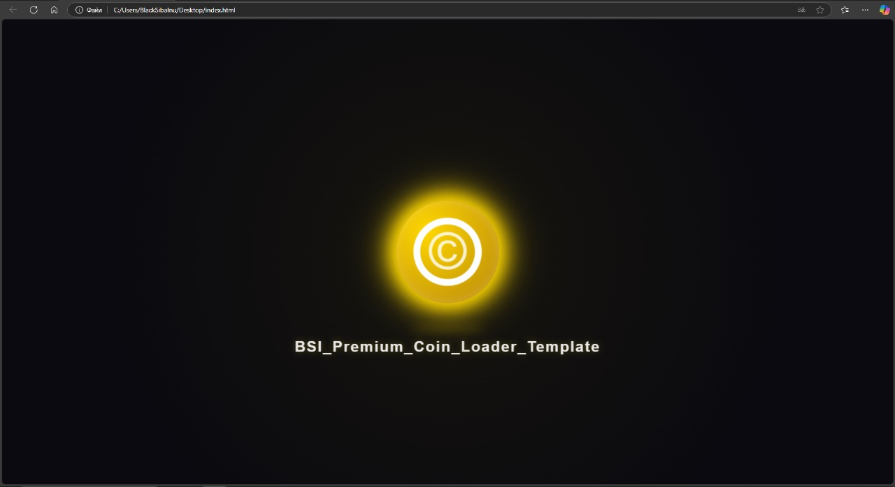

# Анимированный загрузчик BSI



## Обзор проекта

Представляем **Анимированный загрузчик BSI** — изысканное решение для визуализации процесса загрузки в веб-приложениях. Этот компонент особенно эффективен для проектов, связанных с цифровыми активами и криптовалютами, создавая захватывающий визуальный опыт для пользователей.

### Ключевые преимущества

- ✨ **Световая анимация**: Уникальный эффект пульсирующего свечения
- 🔄 **Динамическое взаимодействие**: Элементы реагируют на действия пользователя
- 💫 **Фирменная символика**: Встроенный символ авторского права как часть дизайна
- 🎭 **Премиальная эстетика**: Контрастное сочетание темных тонов и золотых элементов

## Установка

1. **Получение кода:**
   ```bash
   git clone https://github.com/yourusername/shiba-inu-loader.git
   ```

2. **Переход в папку проекта:**
   ```bash
   cd shiba-inu-loader
   ```

3. **Запуск демонстрации:**
   - Запустите `index.html` через веб-браузер

## Руководство по внедрению

Интеграция загрузчика максимально упрощена: добавьте необходимый HTML-код в структуру страницы и настройте CSS-стили под ваш дизайн.

## Правовая информация

Проект доступен по лицензии MIT. Детали в файле [LICENSE](LICENSE).

## Обратная связь

По всем вопросам: [blacksibainu@gmail.com](blacksibainu@gmail.com)

